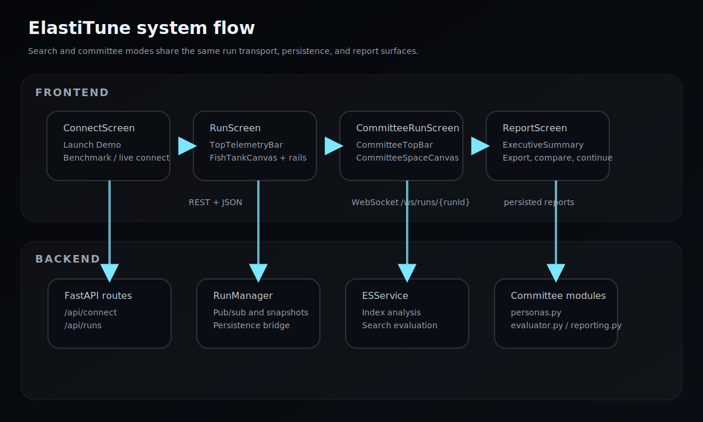

# ElastiTune

ElastiTune is a live Elasticsearch tuning demo with two modes:

- `Search` mode optimizes relevance for a real index or bundled benchmark.
- `Committee` mode simulates a buying committee that scores and rewrites proposal documents.

**Live demo:** [elastitune.replit.app](https://elastitune.replit.app/)



## Happy Path

1. Open the connect screen.
2. Click `Launch Demo` for the fastest walkthrough.
3. Or choose a benchmark preset and tune a real index.
4. Watch the run screen update in real time.
5. Open the report and export the result.

For the short version first, read the [Executive Summary](docs/executive-summary.md). For a presenter-friendly walkthrough, see [docs/demo-narrative.md](docs/demo-narrative.md).

## Quick Start

Prerequisites: Python 3.11+, Node 18+, and Elasticsearch 8.x.

```bash
python3 -m venv .venv
source .venv/bin/activate
pip install -r backend/requirements.txt
cp .env.example .env
python3 -m uvicorn backend.main:app --reload --port 8000
cd frontend
npm install
npm run dev
```

Docker Compose can start the full stack locally:

```bash
docker compose up --build
```

## Docs

- [Local development workflow](docs/CONTRIBUTING.md)
- [Committee mode overview](docs/committee.md)
- [Executive Summary](docs/executive-summary.md)
- [API reference](docs/api-reference.md)
- [Benchmark guide](BENCHMARKS.md)
- [GitHub research notes](docs/github-research.md)
- [Task map](CODEX_TASKS.md)

## Testing

```bash
python3 -m pytest backend/tests/ -v
python3 backend/scripts/smoke_app.py
cd frontend && npx tsc --noEmit && npm run build
```

## Benchmarks

Five benchmark datasets are bundled. Use `python3 benchmarks/setup.py` to load them, or `--reset` to wipe and reload.

| Benchmark | Index | Docs | Eval queries |
|---|---|---:|---:|
| Product Store | `products-catalog` | 931 | 8 |
| Books Catalog | `books-catalog` | 1,000 | 12 |
| Workplace Docs | `workplace-docs` | 15 | 16 |
| Security SIEM | `security-siem` | 301 | 18 |
| TMDB Movies | `tmdb-movies` | 8,516 | 12 |

## Architecture

- **Backend:** FastAPI, Pydantic v2, AsyncElasticsearch, SQLite persistence, WebSocket streaming.
- **Frontend:** React 18, TypeScript, Vite, Zustand, Canvas rendering.
- **Run services:** `RunManager`, `ESService`, and committee modules coordinate live search and committee flows.
- **Transport:** one WebSocket per run, with persisted reports available after completion.

## More Docs

- [Demo narrative](docs/demo-narrative.md)
- [API reference](docs/api-reference.md)
- [Committee mode guide](docs/committee.md)
- [Benchmark guide](BENCHMARKS.md)
- [Contributor guide](docs/CONTRIBUTING.md)

## Replit

`replit.nix` and `.replit` are included. Import the repo into Replit, set the variables from `.env.example`, and run:

```bash
bash setup.sh && bash start.sh
```
