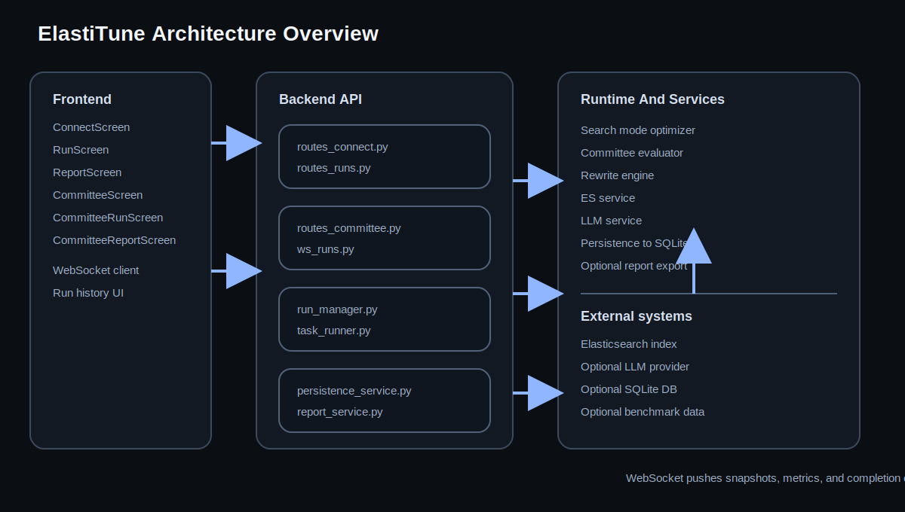

# ElastiTune

ElastiTune is a dual-mode optimization demo for Elasticsearch.

- **Search mode** tunes relevance profiles against an eval set and reports nDCG lift.
- **Committee mode** simulates a buying committee that reviews and rewrites a document until the message is stronger.

**Live demo:** [elastitune.replit.app](https://elastitune.replit.app/)


> *Elasticsearch is the piano. ElastiTune is the piano tuner.*

## Happy Path

The shortest path through the product is:

1. Connect to Elasticsearch or load a benchmark preset.
2. Launch a run in search mode or committee mode.
3. Watch the live telemetry update over WebSocket.
4. Open the report and export the result when the run completes.

For a presenter-friendly walkthrough, see [docs/demo-narrative.md](docs/demo-narrative.md).

## Quick Start

**Prerequisites:** Python 3.11+, Node 18+, and a running Elasticsearch 8.x instance.

```bash
# Backend
python3 -m venv .venv && source .venv/bin/activate
pip install -r backend/requirements.txt
python3 -m uvicorn backend.main:app --reload --port 8000

# Frontend in a second terminal
cd frontend
npm install
npm run dev
```

Or start the full stack with Docker Compose:

```bash
docker compose up --build
```

## Modes

### Search Mode

- Connect to a live Elasticsearch index or one of the bundled benchmarks.
- Evaluate a baseline profile.
- Run controlled experiments across boosts, match strategy, fuzziness, hybrid weights, and fusion settings.
- Keep only changes that improve score.

### Committee Mode

- Upload a proposal, report, or other boardroom-facing document.
- Generate or supply personas.
- Score the document through the committee loop.
- Rewrite sections until the committee is more supportive.

## Architecture

- **Backend:** FastAPI, Pydantic v2, async Elasticsearch access, and optional SQLite-backed persistence for saved runs and reports.
- **Frontend:** React 18, TypeScript, Vite, Zustand, Canvas, and Recharts.
- **Realtime:** One WebSocket per run for snapshots, metrics, and completion events.
- **Docs:** System overview in [docs/architecture.svg](docs/architecture.svg), API reference in [docs/api-reference.md](docs/api-reference.md), and committee behavior in [docs/committee.md](docs/committee.md).



## Runs And Reports

- `GET /api/runs/{runId}` returns the current search snapshot.
- `GET /api/committee/runs/{runId}` returns the current committee snapshot.
- `GET /api/runs/{runId}/report` and `GET /api/committee/runs/{runId}/report` return the final report payloads.
- `GET /api/runs` lists persisted search runs when persistence is configured.

## Testing

```bash
python3 -m pytest backend/tests -q
python3 backend/scripts/smoke_app.py
cd frontend && npx tsc --noEmit && npm run build
```

## Benchmarks

See [docs/BENCHMARKS.md](docs/BENCHMARKS.md) for the benchmark harness, the `elastic-product-store` target, and how to add a new benchmark pack.

## Contributing

See [docs/CONTRIBUTING.md](docs/CONTRIBUTING.md) for local development, test commands, smoke checks, and troubleshooting.

## Deploy To Replit

`replit.nix` and `.replit` are included. Import the repo into Replit, set the environment variables from `.env.example` in Secrets, then run:

```bash
bash setup.sh && bash start.sh
```

## Related Projects

| Project | What it does | Link |
|---|---|---|
| **AutoResearch** | An autonomous LLM training experiment that explores a small but real training loop. | [github.com/karpathy/autoresearch](https://github.com/karpathy/autoresearch) |
| **MiroFish** | A swarm intelligence engine for multi-agent prediction tasks. | [github.com/666ghj/MiroFish](https://github.com/666ghj/MiroFish) |

## Stack

| Layer | Technology |
|---|---|
| Backend | FastAPI, Uvicorn, Pydantic v2, Elasticsearch client libraries |
| Frontend | React 18, TypeScript, Vite, Zustand |
| Visualization | Canvas, Recharts, framer-motion |
| Evaluation | nDCG@10 and committee scoring |
| Packaging | Docker Compose, Replit |
